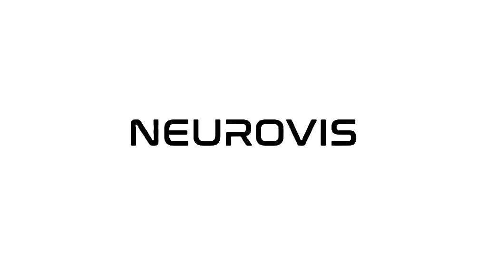
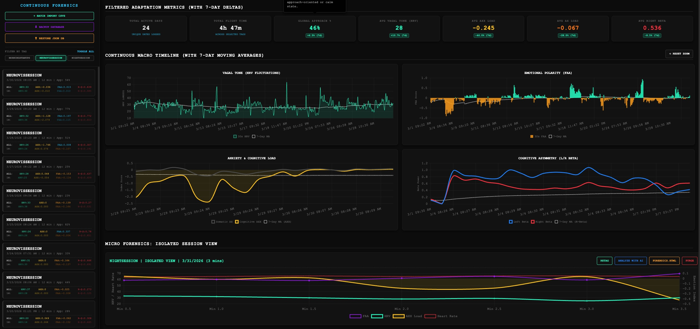
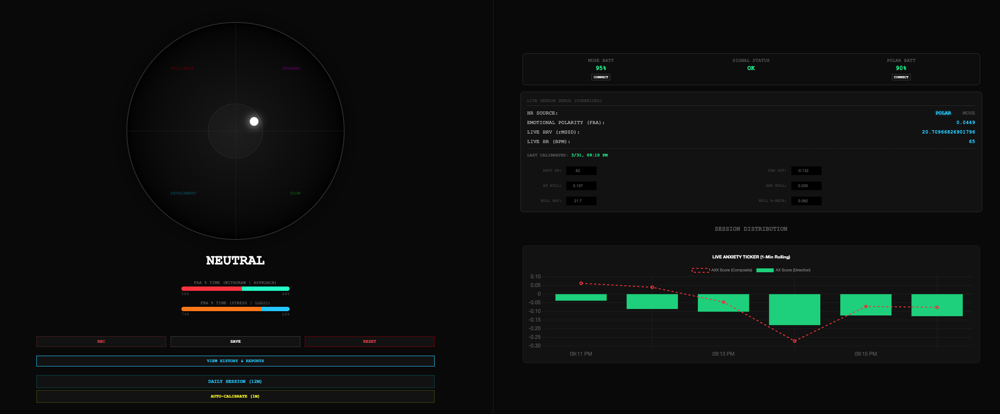
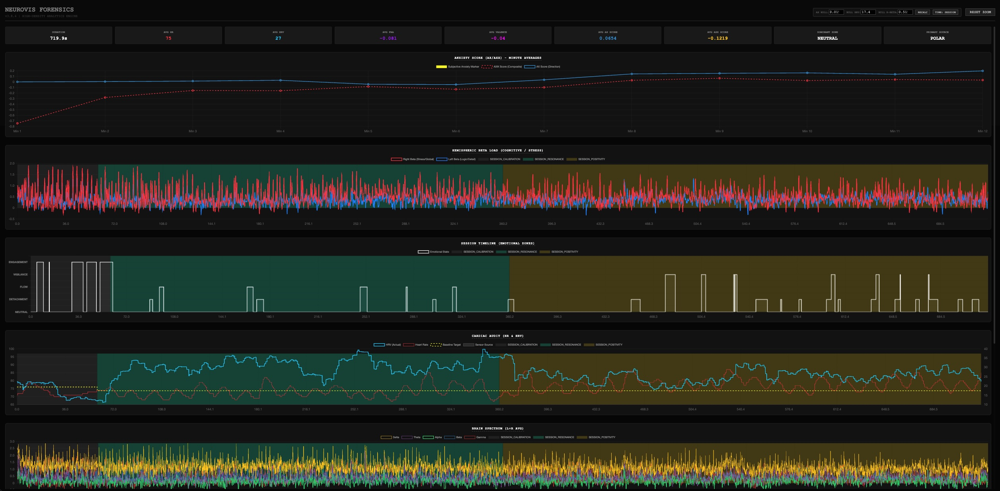
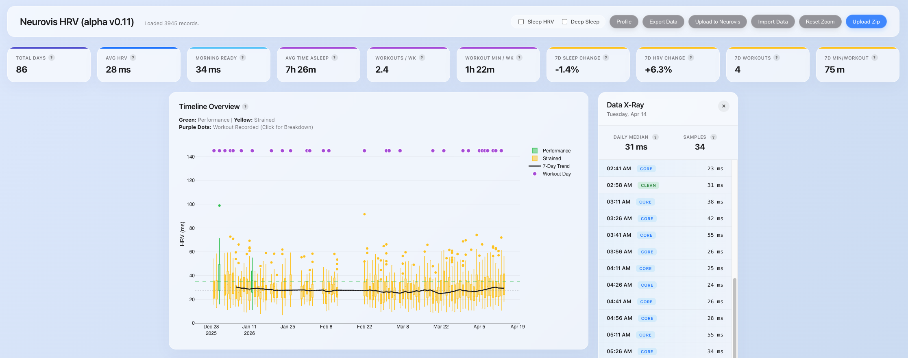

<p align="center">
  
</p>

<h3 align="center">Your Biometrics. Unlocked &amp; Uncompromised.</h3>

<p align="center">
  A personal, edge-computed EEG + HRV biofeedback platform — built by one person over several years,
  self-hosted on a Raspberry Pi 4, and open-sourced for anyone who wants their physiology data
  to stay theirs.
  <br>
  <a href="https://neurovis.io"><strong>neurovis.io</strong></a> ·
  <a href="https://neurovis.io/about.html">About / Contact</a> ·
  <a href="https://neurovis.io/research.html">Research &amp; References</a>
</p>

---

## What this is

Neurovis combines real-time EEG (Muse headband) and HRV (Polar H10 chest strap / Apple Watch) sensor
data with AI-assisted analysis, built around one core idea: **processing should happen locally, and
your biometric data shouldn't have to live on someone else's server to be useful.** Where a server is
involved at all, it's the author's own Raspberry Pi, not a cloud platform.

This repo isn't a single app — it's three related tools that grew organically over the project's
life. Each is documented in its own section below.

## Screenshots

|                                                                |                                                                |
| :------------------------------------------------------------: | :------------------------------------------------------------: |
|        |       |
| **Live Dashboard** — real-time valence/arousal, HR/HRV, and Muse/Polar sensor status ([`Fusion/Neurovis.html`](Fusion/Neurovis.html)) | **Continuous Forensics** — longitudinal trend reports across all logged sessions ([`Fusion/MindRelay.html`](Fusion/MindRelay.html)) |
|               |          |
| **Session Deep-Dive** — high-density forensic replay of a single session ([`Fusion/emotionreplay.html`](Fusion/emotionreplay.html)) | **HRV Dashboard** — Apple Watch sleep/HRV/workout trends ([`HRV/NeurovisAW.html`](HRV/NeurovisAW.html)) |

## Repository layout

| Directory | What it is | Runs where |
|---|---|---|
| [`Fusion/`](Fusion/) | The real-time dashboard: connects directly to a Muse EEG headband and Polar H10 chest strap over **Web Bluetooth**, and runs all the signal processing **in-browser** via [Pyodide](https://pyodide.org/) (Python compiled to WebAssembly). No backend process is involved — this is the architecture that actually delivers on the "your data stays local" promise. Session history is kept in the browser's IndexedDB. | Static files, any browser |
| [`Agents/`](Agents/) | A local FastAPI + [LlamaIndex](https://www.llamaindex.ai/) multi-agent chatbot for conversational analysis of exported session/health data — a router agent delegates to a meditation/EEG specialist and an Apple Watch/HRV specialist. Runs against a **local Ollama** model (`qwen2.5`), not a cloud LLM. Not currently exposed to the public web — it's a personal analysis tool. | Locally, via `python3` |
| [`HRV/`](HRV/) | Companion pieces for Apple Watch data: `NeurovisAW.html` is the standalone HRV dashboard (screenshot above), and `uploader.py` is a small Flask endpoint that optionally accepts an anonymized, opt-in daily summary for research purposes — nothing leaves the browser unless you explicitly click "Upload to Neurovis." | `uploader.py` on the Pi; HTML anywhere |

## Getting started

There's no build step, package manifest, or bundler — everything here is plain Python/HTML/JS, run directly.

### Fusion — the real-time dashboard

Pure static files. Serve the directory and open it in a browser (Web Bluetooth requires Chrome/Edge and HTTPS or `localhost`):

```bash
cd Fusion && python3 -m http.server 8080
# open http://localhost:8080/Neurovis.html
```

Pyodide fetches `hardware.py` and `Neurovis.py` from this same server and runs them in-browser at ~20Hz — there's nothing else to configure.

### Agents — the local AI analyst

Requires a local [Ollama](https://ollama.com/) install with the `qwen2.5` model, plus:

```bash
pip3 install fastapi uvicorn pandas numpy scipy matplotlib pydantic \
  llama-index-core llama-index-llms-ollama llama-index-embeddings-huggingface

ollama pull qwen2.5
cd Agents && python3 neurovisAgent.py
# open http://localhost:8000
```

Upload an Apple Health export and/or a Neurovis session CSV/JSON through the UI, then chat with it — the router sends your question to whichever specialist agent has the relevant data loaded.

### HRV — Apple Watch dashboard + optional research upload

```bash
cd HRV && python3 -m http.server 8081
# open http://localhost:8081/NeurovisAW.html, then Import Data / Upload Zip

# optional: the anonymized-upload receiver
pip3 install flask flask-cors
python3 uploader.py   # binds :8002
```

## Status &amp; disclaimer

This is a solo, ongoing personal project, not a medical device or clinical tool — metrics like the
Anxiety/AXX scores, Functional Beta Asymmetry, and similar are experimental research constructs, not
diagnostic measures. Some pieces (EEG/ECG live recording in particular) are explicitly **alpha**
quality per the site itself. Use it, learn from it, fork it — just don't treat it as medical advice.

## License

[GNU General Public License v3.0](LICENSE).
